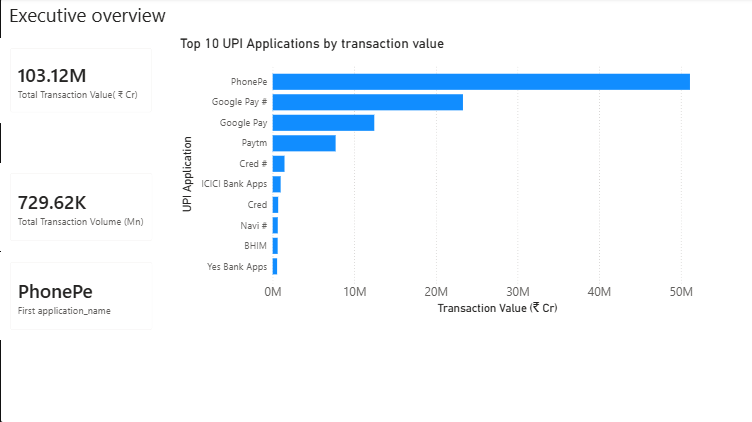
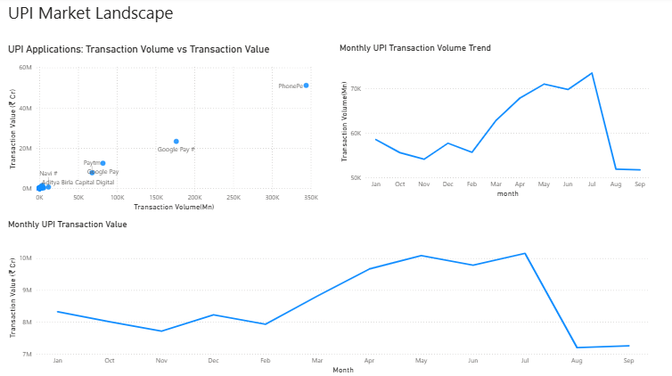
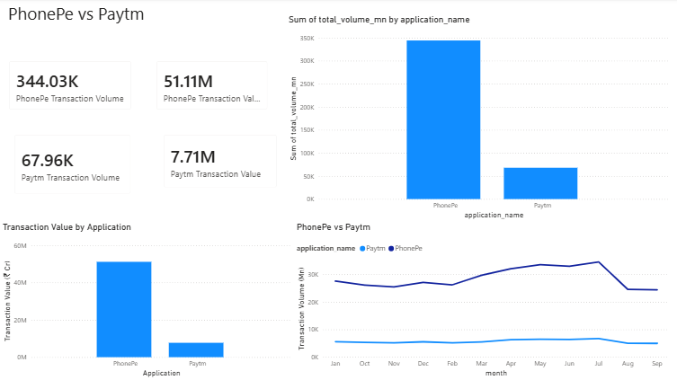
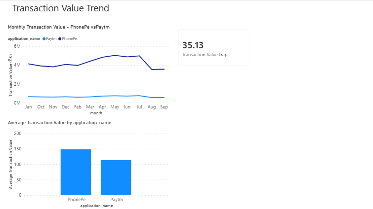

# PhonePe vs Paytm — UPI Competitive Analytics

UPI has become one of India's major digital payment systems, with multiple applications competing across transaction volume and transaction value. This project analyzes historical UPI application data to understand market position, transaction behavior, competitive performance, and trends, with a focused comparison of PhonePe and Paytm.

The project combines **Python, SQL, Google BigQuery, and Power BI** to transform transaction data into analytical insights and an interactive business intelligence dashboard.

---

## Project Overview

This project performs UPI market and competitive analytics using application-level transaction data.

The analysis focuses on:

- Identifying leading UPI applications by transaction volume
- Identifying leading applications by transaction value
- Measuring market share by volume and value
- Analyzing monthly transaction trends
- Comparing PhonePe and Paytm across transaction volume and value
- Measuring the transaction-value gap between PhonePe and Paytm
- Comparing average transaction value across applications
- Translating analytical results into business insights

### Analytical Workflow

**Raw Data → Python Data Preparation → BigQuery SQL Analysis → Power BI Dashboard → Business Insights**

---

# Key Findings

## 1. PhonePe has a substantial transaction-volume lead

The dashboard reports:

- **PhonePe:** 344.03K transactions
- **Paytm:** 67.96K transactions

PhonePe therefore processed approximately **5.1× the transaction volume of Paytm** in the displayed comparison.

Within the combined PhonePe–Paytm transaction volume shown in the dashboard:

- **PhonePe:** approximately 83.5%
- **Paytm:** approximately 16.5%

This demonstrates a substantial difference in transaction activity between the two platforms.

---

## 2. PhonePe leads Paytm in transaction value

The dashboard reports:

- **PhonePe transaction value:** 51.11M
- **Paytm transaction value:** 7.71M

Both figures represent the same transaction-value measure used in the Power BI model.

The transaction-value visuals use **₹ Cr** as the displayed unit.

PhonePe therefore shows a substantially higher aggregate transaction value than Paytm in the analyzed dataset.

---

## 3. PhonePe maintains a substantial transaction-value lead

The monthly transaction-value trend shows PhonePe consistently above Paytm throughout the displayed period.

The dashboard reports a **₹35.13 Cr transaction-value gap** for the comparison KPI.

This gap represents the comparison shown by the dashboard's transaction-value analysis and should not be interpreted as the simple subtraction of the two aggregate transaction-value cards.

---

## 4. PhonePe leads across multiple competitive metrics

The comparison is not based on transaction volume alone.

PhonePe is ahead of Paytm in the major metrics examined in the dashboard:

- Transaction volume
- Total transaction value
- Monthly transaction-value trend
- Average transaction value

This indicates that the competitive difference is broader than a single KPI.

---

## 5. Average transaction value differs between the two applications

The Power BI dashboard shows approximately:

- **PhonePe:** ~150
- **Paytm:** ~120

The dashboard visual does not explicitly state a currency unit for this calculated measure, so no additional currency interpretation is assigned in this README.

The difference provides an additional dimension for understanding transaction behavior between the two platforms.

---

# Tools & Technologies

## Python

Python was used for:

- Data inspection
- Data cleaning and preparation
- Application-name standardization
- Numeric-field validation
- Exploratory analysis
- Preparing the dataset for analytical querying

The Python analysis notebook is included in the repository:

`Phonepe_Paytm_UPI_Analytics_Python.ipynb`

---

## Google BigQuery

Google BigQuery was used as the SQL analysis environment for:

- Aggregating transaction metrics
- Ranking UPI applications
- Calculating market share
- Calculating average transaction value
- Comparing PhonePe and Paytm
- Calculating competitive gaps

---

## SQL

Eight analytical SQL queries were developed:

1. Top UPI applications by transaction volume
2. Top UPI applications by transaction value
3. Market share by transaction volume
4. Market share by transaction value
5. Average transaction value
6. PhonePe vs Paytm comparison
7. PhonePe–Paytm transaction-value gap
8. PhonePe–Paytm market share

The individual queries are available in the `sql/` directory.

---

## Power BI

Power BI was used to create the final four-page interactive dashboard.

The dashboard covers:

- Executive Overview
- UPI Market Landscape
- PhonePe vs Paytm
- Transaction Value Trend
- KPI analysis
- Application comparisons
- Monthly trends

The Power BI source file is available in the `powerbi/` directory.

---

# Power BI Dashboard

## Page 1 — Executive Overview

The Executive Overview provides a high-level view of the UPI application landscape.

### Analysis includes

- Overall transaction metrics
- Leading UPI applications
- Transaction-value comparison
- High-level market overview

---

## Page 2 — UPI Market Landscape

The UPI Market Landscape page examines application-level performance and monthly trends.

### Analysis includes

- Transaction volume vs transaction value by application
- Monthly transaction-volume trend
- Monthly transaction-value trend
- Application-level positioning

This page provides broader market context before moving into the focused PhonePe vs Paytm comparison.

---

## Page 3 — PhonePe vs Paytm

This page provides a direct competitive comparison between PhonePe and Paytm.

### Analysis includes

- PhonePe transaction volume
- Paytm transaction volume
- PhonePe transaction value
- Paytm transaction value
- Application-level value comparison
- Monthly transaction-volume trend

The dashboard reports **344.03K PhonePe transactions versus 67.96K Paytm transactions**, representing an approximately **5.1× difference in transaction volume**.

---

## Page 4 — Transaction Value Trend

This page focuses on transaction-value performance and the difference between PhonePe and Paytm.

### Analysis includes

- Monthly transaction-value trend
- PhonePe vs Paytm transaction-value comparison
- Transaction-value gap
- Average transaction value by application

The dashboard reports a **₹35.13 Cr transaction-value gap** for the displayed comparison KPI.

---

# SQL Analysis

The repository contains eight SQL queries used to perform the analytical calculations.

### Query 01 — Top UPI Apps by Volume

Ranks UPI applications according to transaction volume.

**File:** `01_top_upi_apps_by_volume.sql`

### Query 02 — Top UPI Apps by Value

Ranks UPI applications according to transaction value.

**File:** `02_top_upi_apps_by_value.sql`

### Query 03 — Market Share by Volume

Calculates application-level market share based on transaction volume.

**File:** `03_market_share_by_volume.sql`

### Query 04 — Market Share by Value

Calculates application-level market share based on transaction value.

**File:** `04_market_share_by_value.sql`

### Query 05 — Average Transaction Value

Calculates average transaction value across applications.

**File:** `05_average_transaction_value.sql`

### Query 06 — PhonePe vs Paytm

Performs a focused comparison between PhonePe and Paytm.

**File:** `06_phonepe_vs_paytm.sql`

### Query 07 — PhonePe–Paytm Gap

Calculates the competitive gap between PhonePe and Paytm.

**File:** `07_phonepe_paytm_gap.sql`

### Query 08 — PhonePe–Paytm Share

Calculates the relative share of PhonePe and Paytm within the competitive comparison.

**File:** `08_phonepe_paytm_share.sql`

---

# Data

The project uses the following dataset:

`upi_apps_historical_cleaned_2022_2026.csv`

The dataset contains historical application-level UPI transaction information used for the market and competitive analysis.

Relevant analytical fields include:

- Application name
- Transaction volume
- Transaction value
- Monthly observations
- Year
- Application-level transaction metrics

---

# Data Source & Limitations

The project uses the cleaned UPI application dataset included in this repository.

The dataset filename indicates coverage associated with the **2022–2026 period**.

The project is intended primarily as a **FinTech analytics and business intelligence portfolio project**.

### Important limitations

- The analysis reflects the data contained in the supplied dataset.
- The dashboard should not be interpreted as a live UPI market-monitoring system.
- The data is aggregated at the application level rather than representing individual customer transactions.
- Market-share results depend on the applications and observations represented in the dataset.
- Power BI may abbreviate displayed values using formats such as `K` and `M`.
- The transaction-value visuals use ₹ Cr as displayed by the Power BI model.
- The average transaction-value visual does not explicitly state a currency unit, so no currency is assigned to that metric in this README.
- The dataset should be refreshed against the latest available source data before being used as a current market snapshot.

---

# Analytical Workflow

## 1. Data Preparation

The dataset was first inspected and prepared using Python.

The preparation process included:

- Inspecting the dataset structure
- Reviewing application names
- Validating numerical fields
- Preparing the data for analytical querying

---

## 2. BigQuery SQL Analysis

The cleaned dataset was analyzed using Google BigQuery.

SQL was used to calculate:

- Application rankings
- Transaction volume
- Transaction value
- Market share
- Average transaction value
- PhonePe vs Paytm comparisons
- Competitive gaps

---

## 3. Power BI Visualization

The analytical outputs were used to build a four-page Power BI dashboard.

The dashboard progresses from:

**Market Overview → Market Landscape → Competitive Comparison → Transaction-Value Analysis**

---

## 4. Business Interpretation

The final stage focused on interpreting the analytical results rather than simply displaying charts.

The analysis identifies PhonePe as the stronger performer relative to Paytm across the major metrics examined.

---

# Business Interpretation

The analysis demonstrates why FinTech payment performance should not be evaluated using a single metric.

Transaction volume provides an indication of transaction activity, while transaction value provides an additional view of monetary scale.

Average transaction value adds another dimension by showing differences in the value composition of transactions.

The PhonePe vs Paytm comparison therefore evaluates competitive performance across:

**Volume → Value → Market Share → Average Transaction Value → Monthly Trends → Competitive Gap**

This provides a more comprehensive view of the competitive position of the two platforms.

---

# Repository Structure

The repository is organized into the following components:

### Power BI

- `powerbi/Phonepe_Paytm_Analytics.pbix` — Power BI dashboard source file

### SQL

The `sql/` directory contains:

- `01_top_upi_apps_by_volume.sql`
- `02_top_upi_apps_by_value.sql`
- `03_market_share_by_volume.sql`
- `04_market_share_by_value.sql`
- `05_average_transaction_value.sql`
- `06_phonepe_vs_paytm.sql`
- `07_phonepe_paytm_gap.sql`
- `08_phonepe_paytm_share.sql`

### Dashboard Screenshots

The repository root contains:

- `01_executive_overview.png`
- `02_upi_market_landscape.png`
- `03_phonepe_vs_paytm.png`
- `04_transaction_value_trend.png`

### Analysis & Dataset

- `Phonepe_Paytm_UPI_Analytics_Python.ipynb` — Python analysis notebook
- `upi_apps_historical_cleaned_2022_2026.csv` — cleaned UPI dataset
- `README.md` — project documentation

---

# Skills Demonstrated

## Data Analytics

- Data cleaning
- Data preparation
- Exploratory data analysis
- Data validation
- Data aggregation

## SQL & BigQuery

- SQL querying
- Aggregations
- Ranking
- Market-share calculations
- Competitive analysis
- Gap analysis
- Average transaction-value calculations
- Google BigQuery

## Power BI

- KPI development
- Dashboard design
- Market analysis
- Competitive analysis
- Trend analysis
- Data visualization
- Business storytelling

## FinTech Analytics

- UPI ecosystem analysis
- Digital payment analytics
- Market-share analysis
- Payment transaction analysis
- Competitive intelligence
- Transaction-value analysis

---

# Project Outcome

This project demonstrates an end-to-end FinTech analytics workflow:

**Python → BigQuery SQL → Power BI → Business Insights**

The analysis identifies a substantial competitive advantage for PhonePe over Paytm in the displayed transaction-volume and transaction-value comparisons.

PhonePe processes approximately **5.1× the transaction volume of Paytm** in the displayed comparison, while the dashboard also shows a significant transaction-value advantage and a **₹35.13 Cr transaction-value gap** for the displayed comparison KPI.

The project demonstrates how raw payment data can be transformed into structured competitive intelligence using SQL, Python, and Power BI.

---

# Future Improvements

Potential extensions to the project include:

- Adding newer UPI application data
- Automating data refresh
- Adding month-over-month growth metrics
- Adding year-over-year growth
- Tracking market-share movement over time
- Adding forecasting models
- Adding additional competitive metrics
- Building automated market-monitoring dashboards
- Incorporating customer or merchant-level data where available

---

# Project Files

- **Power BI Dashboard:** `powerbi/Phonepe_Paytm_Analytics.pbix`
- **SQL Analysis:** `sql/`
- **Python Analysis:** `Phonepe_Paytm_UPI_Analytics_Python.ipynb`
- **Dataset:** `upi_apps_historical_cleaned_2022_2026.csv`
- **Dashboard Screenshots:** repository root

---

# Conclusion

This project demonstrates an end-to-end approach to **UPI market and competitive analytics**.

By combining Python for data preparation, BigQuery SQL for analytical calculations, and Power BI for visualization, the project converts application-level transaction data into a structured view of market performance.

The PhonePe vs Paytm analysis shows a clear difference in transaction activity and transaction value within the analyzed dataset, while the broader UPI analysis provides context around application rankings, market share, transaction behavior, and monthly trends.

The project demonstrates the ability to move beyond dashboard creation and translate financial data into **business-oriented competitive insights**.
